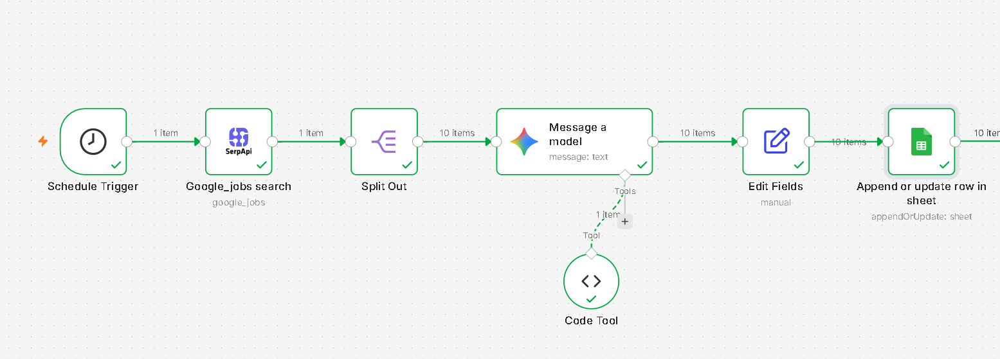
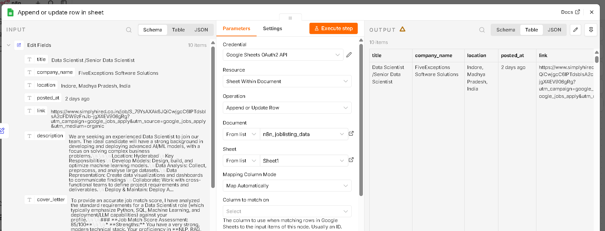
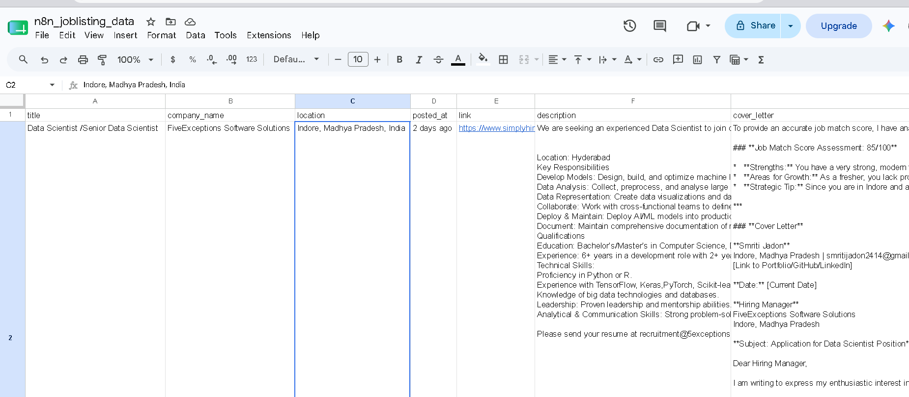

# agentic_ai_automated_job_list
Automated Google Jobs scraper built with n8n. Runs on a schedule, fetches job listings via SerpApi, processes each result using Gemini AI, and appends structured data to a Google Sheet. Ideal for job market tracking and lead generation.

🤖 Automated Job Scraper — n8n Workflow
An automated workflow that scrapes Google Jobs listings using SerpApi, processes them with Gemini AI, and saves structured results to Google Sheets — all on a schedule.

✨ Features

⏰ Scheduled automatic job scraping
🔍 Google Jobs search via SerpApi
🤖 AI-powered job data processing with Gemini
📊 Auto-saves results to Google Sheets

🛠️ Prerequisites

n8n account (cloud or self-hosted)
SerpApi API key → serpapi.com
Google AI Studio API key → aistudio.google.com
Google Sheets access

📦 Installation & Import

Download the workflow.json file from this repo
Open your n8n dashboard
Click "Add Workflow" → "Import from file"
Select the downloaded workflow.json
Click Import

⚙️ Configuration
After importing, update these nodes:
NodeWhat to updateGoogle_jobs searchAdd your SerpApi API keyMessage a modelAdd your Gemini API keyAppend or update row in sheetConnect your Google account & select your Sheet

🚀 Usage

Set your desired schedule in the Schedule Trigger node
Configure your job search keywords in the SerpApi node
Activate the workflow
Check your Google Sheet for results!

📁 Project Structure
workflow.json   → Main n8n workflow file
README.md       → Project documentation

⚠️ Notes

Free SerpApi plan has limited monthly searches
Use gemini-2.0-flash-lite model to stay within free rate limits
If you hit rate limits, enable retry in the Gemini node settings

📄 License
MIT License

## 📸 Screenshots
### Workflow

### Google Sheets Mapping

### Output in Google Sheets

